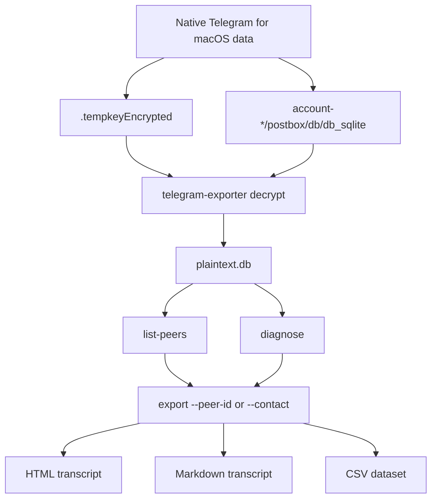
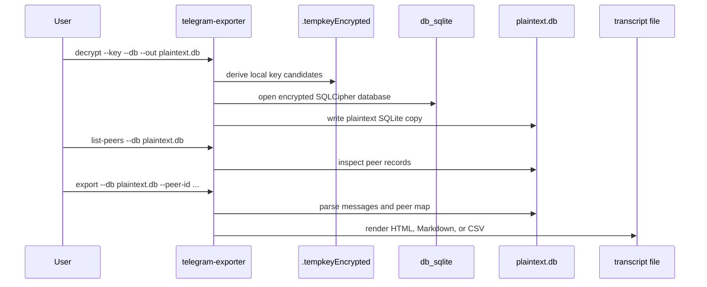

# 💬 Telegram for macOS Message Exporter

> Offline recovery and transcript export for the native Telegram for macOS app.

[](https://github.com/soakes/telegram-message-exporter/actions/workflows/ci.yml)
[](https://www.python.org/downloads/)
[](#requirements)
[](https://macos.telegram.org/)
[](LICENSE)
[](https://black.readthedocs.io/)
[](https://docs.astral.sh/ruff/)
[](https://pylint.readthedocs.io/)

Built for recovery situations where the only remaining copy of a Telegram
conversation is the encrypted local cache on a Mac. The tool decrypts the local
`db_sqlite`, understands Telegram's Postbox storage well enough to find peers
and messages, then writes a readable transcript in HTML, Markdown, or CSV.

This targets the **native Telegram for macOS app** from
[macos.telegram.org](https://macos.telegram.org/) or the Homebrew `telegram`
cask. It does **not** target the cross-platform Telegram Desktop/Qt app, iOS
backups, Android backups, the Mac App Store version, or Telegram's cloud export
format.

**Quick links:** [🚀 Quick Start](#quick-start) · [🔄 How It Works](#how-it-works) · [🧪 Usage](#usage) · [🧰 CLI Reference](#cli-reference) · [🩺 Troubleshooting](#troubleshooting) · [🙏 Credits](#credits)

## 🧭 Table of Contents

- [📖 Overview](#overview)
- [✨ Capabilities](#capabilities)
- [🔄 How It Works](#how-it-works)
- [✅ Requirements](#requirements)
- [🚀 Quick Start](#quick-start)
- [🧪 Usage](#usage)
- [🧰 CLI Reference](#cli-reference)
- [📄 Output Formats](#output-formats)
- [🗺️ Key Paths](#key-paths)
- [🔐 Safety and Privacy](#safety-and-privacy)
- [🩺 Troubleshooting](#troubleshooting)
- [⚠️ Limitations](#limitations)
- [❓ FAQ](#faq)
- [🔖 Versioning](#versioning)
- [🧹 Quality Checks](#quality-checks)
- [🗂️ Project Structure](#project-structure)
- [🙏 Credits](#credits)
- [🤝 Contributing](#contributing)
- [📄 License](#license)

---

## 📖 Overview

Telegram for macOS stores local message data in an encrypted SQLite database.
When a chat has been deleted from Telegram's cloud state, the local cache can be
the last useful source of evidence, provided it still exists on disk and has
not been overwritten or synced away.

`telegram-message-exporter` provides a focused recovery path:

- decrypt the local SQLCipher database using `.tempkeyEncrypted`
- inspect the resulting plaintext SQLite copy
- list likely peers and contacts
- export one chat or all decoded messages to a clean transcript

The tool is intentionally offline. It does not call Telegram APIs, restore
messages back into Telegram, or upload recovered data anywhere.

### First Recovery Checklist

1. Stop using Telegram on the Mac as soon as possible.
2. Keep the Mac offline if you are trying to preserve a recently deleted chat.
3. Copy the Telegram key and database to a separate working directory before
   experimenting.
4. Install the tool in a virtual environment.
5. Decrypt to `plaintext.db`.
6. Run `list-peers` to find the chat you care about.
7. Export HTML first for reading, then CSV if you need analysis in a
   spreadsheet.
8. Store `plaintext.db` and transcript files securely; they contain private
   message content.

---

## ✨ Capabilities

- **Offline decryption**: derives SQLCipher keys from Telegram's local
  `.tempkeyEncrypted` file
- **Passcode support**: accepts `--passcode` or `TG_LOCAL_PASSCODE` when
  Telegram Passcode Lock is enabled
- **Postbox parsing**: handles the native macOS app's key/value Postbox tables
- **Peer discovery**: searches local peer records so exports can use names
  instead of raw IDs where possible
- **Targeted exports**: filters by peer ID, contact name, message limit, start
  date, and end date
- **Readable output**: writes styled HTML, Markdown, or CSV with timestamps,
  speakers, directions, and link handling
- **Diagnostics**: samples tables and rows when Telegram storage changes or a
  cache does not match the expected shape

---

## 🔄 How It Works

The normal recovery flow has two phases: decrypt the database, then export from
the plaintext copy.



The CLI never needs Telegram network access. Everything comes from local files
that already exist on the Mac.



---

## ✅ Requirements

- macOS with native Telegram for macOS data present
- Python 3.10 or newer
- SQLCipher support for the `sqlcipher3` Python package
- Telegram local passcode, if Passcode Lock was enabled
- A virtual environment for local installs

On macOS, install SQLCipher first if `sqlcipher3` fails to build:

```bash
brew install sqlcipher
```

---

## 🚀 Quick Start

### 1. Install

From a clone:

```bash
git clone https://github.com/soakes/telegram-message-exporter.git
cd telegram-message-exporter
python3 -m venv .venv
source .venv/bin/activate
pip install -e .
```

Or install the latest revision directly from GitHub:

```bash
pip install -U "git+https://github.com/soakes/telegram-message-exporter.git"
```

### 2. Locate Telegram's database

The native macOS app normally stores its data below:

```bash
ls "$HOME/Library/Group Containers/6N38VWS5BX.ru.keepcoder.Telegram/stable"
ls "$HOME/Library/Group Containers/6N38VWS5BX.ru.keepcoder.Telegram/stable"/account-*/postbox/db/db_sqlite
```

You need:

- `.tempkeyEncrypted`
- the matching `account-*/postbox/db/db_sqlite`

### 3. Decrypt to a working copy

```bash
telegram-exporter decrypt \
  --key "$HOME/Library/Group Containers/6N38VWS5BX.ru.keepcoder.Telegram/stable/.tempkeyEncrypted" \
  --db "$HOME/Library/Group Containers/6N38VWS5BX.ru.keepcoder.Telegram/stable/account-123456/postbox/db/db_sqlite" \
  --out recovery/plaintext.db
```

If Telegram Passcode Lock is enabled:

```bash
TG_LOCAL_PASSCODE="your-passcode" \
telegram-exporter decrypt \
  --key "$HOME/Library/Group Containers/6N38VWS5BX.ru.keepcoder.Telegram/stable/.tempkeyEncrypted" \
  --db "$HOME/Library/Group Containers/6N38VWS5BX.ru.keepcoder.Telegram/stable/account-123456/postbox/db/db_sqlite" \
  --out recovery/plaintext.db
```

### 4. Find a peer

```bash
telegram-exporter list-peers --db recovery/plaintext.db --search "Alex"
```

### 5. Export a transcript

```bash
telegram-exporter export \
  --db recovery/plaintext.db \
  --peer-id 123456789 \
  --me-name "Me" \
  --format html \
  --out recovery/alex.html
```

---

## 🧪 Usage

### Export HTML for one chat

```bash
telegram-exporter export \
  --db recovery/plaintext.db \
  --peer-id 123456789 \
  --format html \
  --me-name "Me" \
  --out recovery/chat.html
```

### Export by contact name

```bash
telegram-exporter export \
  --db recovery/plaintext.db \
  --contact "Alex" \
  --format md \
  --out recovery/alex.md
```

If more than one peer matches, the command prints the candidates and asks you to
rerun with `--peer-id`.

### Export a date range

```bash
telegram-exporter export \
  --db recovery/plaintext.db \
  --peer-id 123456789 \
  --start-date 2024-01-01 \
  --end-date 2024-12-31 \
  --format html \
  --out recovery/chat-2024.html
```

### Export all decoded messages

```bash
telegram-exporter export \
  --db recovery/plaintext.db \
  --format csv \
  --out recovery/all-chats.csv
```

### Inspect an unfamiliar database

```bash
telegram-exporter diagnose --db recovery/plaintext.db
```

Sample a specific table:

```bash
telegram-exporter diagnose --db recovery/plaintext.db --table t7
```

### Debug decryption

```bash
telegram-exporter decrypt \
  --key /path/to/.tempkeyEncrypted \
  --db /path/to/db_sqlite \
  --out recovery/plaintext.db \
  --debug
```

---

## 🧰 CLI Reference

| Command | Purpose |
| --- | --- |
| `decrypt` | Decrypt Telegram's encrypted `db_sqlite` to a plaintext SQLite file |
| `diagnose` | List tables, columns, and sample rows from a plaintext database |
| `list-peers` | Find likely peer IDs by name fragment |
| `export` | Render messages to HTML, Markdown, or CSV |

### `decrypt`

| Flag | Required | Description |
| --- | --- | --- |
| `--key` | yes | Path to `.tempkeyEncrypted` |
| `--db` | yes | Path to encrypted `db_sqlite` |
| `--out` | no | Output plaintext DB path, default `plaintext.db` |
| `--passcode` | no | Telegram local passcode; can also use `TG_LOCAL_PASSCODE` |
| `--debug` | no | Print key/profile diagnostics |

### `diagnose`

| Flag | Required | Description |
| --- | --- | --- |
| `--db` | yes | Path to plaintext SQLite database |
| `--table` | no | Table to sample; defaults to `t7` when present |

### `list-peers`

| Flag | Required | Description |
| --- | --- | --- |
| `--db` | yes | Path to plaintext SQLite database |
| `--search` | no | Name fragment to filter peers |

### `export`

| Flag | Required | Description |
| --- | --- | --- |
| `--db` | yes | Path to plaintext SQLite database |
| `--contact` | no | Contact name to resolve to a peer |
| `--peer-id` | no | Numeric peer ID to export |
| `--table` | no | Override detected message table |
| `--limit` | no | Maximum number of messages |
| `--start-date` | no | Start date, `YYYY-MM-DD` or ISO datetime |
| `--end-date` | no | End date, `YYYY-MM-DD` or ISO datetime |
| `--format` | no | `html`, `md`, or `csv`; default `md` |
| `--out` | no | Output path; defaults to `chat_export.<format>` |
| `--me-name` | no | Display label for outgoing messages; default `Me` |
| `--show-direction` | no | Append `(in)` or `(out)` labels in Markdown |

---

## 📄 Output Formats

| Format | Best for | Notes |
| --- | --- | --- |
| `html` | Reading and sharing a polished transcript | Includes summary cards, date jump, back-to-top, and link handling |
| `md` | Archival text, notes, version control | Compact, portable, and easy to diff |
| `csv` | Analysis in spreadsheets or scripts | Includes date, time, Unix timestamp, direction, speaker, text, peer ID, and author ID |

### Markdown snippet

```markdown
# Telegram Chat History: Alex Example

**Exported:** 2026-02-04 16:05:12

**Total Messages:** 418

---

## Wednesday, February 04, 2026

**14:13:09 — Me**

3h48 is good also
```

### CSV snippet

```csv
date,time,timestamp,direction,speaker,text,peer_id,author_id
2026-02-04,14:13:09,1770214389,out,Me,"3h48 is good also",123456789,123456789
```

---

## 🗺️ Key Paths

Native Telegram for macOS typically stores recovery-relevant files here:

```text
~/Library/Group Containers/6N38VWS5BX.ru.keepcoder.Telegram/stable/
├── .tempkeyEncrypted
└── account-*/
    └── postbox/
        └── db/
            └── db_sqlite
```

The `account-*` directory must match the database you are decrypting. If there
are multiple accounts, try `list-peers` after decrypting each one and keep notes
about which plaintext database came from which account directory.

---

## 🔐 Safety and Privacy

- Work from copies of Telegram files whenever possible.
- Keep the Mac offline during time-sensitive recovery to avoid sync changes.
- Treat `plaintext.db`, HTML, Markdown, and CSV outputs as sensitive private
  data.
- Delete or encrypt intermediate files when recovery work is complete.
- The tool reads local files and writes local outputs only; it does not contact
  Telegram or any third-party recovery service.

---

## 🩺 Troubleshooting

| Symptom | What to check |
| --- | --- |
| `Key file not found` | Confirm the `.tempkeyEncrypted` path and quote paths containing spaces |
| `Database file not found` | Confirm the selected `account-*` directory has `postbox/db/db_sqlite` |
| `Failed to decrypt database` | Verify the key and DB belong to the same Telegram account; pass `--passcode` if Passcode Lock was enabled |
| `file is not a database` | Usually a mismatched key/database pair or an unsupported SQLCipher profile |
| `No peer records found` | Run `diagnose` and confirm this is the native macOS Telegram database |
| `No messages found with the current filters` | Remove date filters, confirm `--peer-id`, or try exporting all decoded messages |
| `sqlcipher3` install fails | Install SQLCipher with Homebrew, then reinstall the package in a clean virtual environment |

For decryption problems, rerun with `--debug`:

```bash
telegram-exporter decrypt \
  --key /path/to/.tempkeyEncrypted \
  --db /path/to/db_sqlite \
  --out recovery/plaintext.db \
  --debug
```

---

## ⚠️ Limitations

- Does not restore messages into Telegram.
- Does not bypass a Telegram local passcode; you need the passcode.
- Does not recover messages that no longer exist in the local cache.
- Does not download content from Telegram servers.
- Does not currently extract media files from Telegram's file cache.
- Some newer or uncommon Telegram message payloads may only partially decode.
- Does not support Telegram Desktop/Qt, the Mac App Store version, mobile
  backups, or Telegram cloud export archives.

---

## ❓ FAQ

**Can this restore a deleted chat inside Telegram?**
No. It exports a transcript from local data; it does not write messages back to
Telegram.

**Should I use the original Telegram database directly?**
The command can read it, but for recovery work it is safer to copy the key and
database into a separate working directory and decrypt from that copy.

**Why does this only support Telegram for macOS?**
The native macOS app uses a different storage layout from Telegram Desktop/Qt
and mobile clients. This project is built around the native app's local
Postbox/SQLCipher data.

**Does it work with the Mac App Store version?**
No. This currently targets the direct download/Homebrew build from
macos.telegram.org. The Mac App Store version uses a different app packaging and
storage setup, so it is outside the supported recovery path.

**Can it recover photos, videos, or documents?**
Not currently. The exporter focuses on decoded message text and transcript
metadata.

---

## 🔖 Versioning

The canonical version is stored in [`VERSION`](VERSION) and exposed by the CLI:

```bash
telegram-exporter --version
```

Use the helper script when preparing a version bump:

```bash
./scripts/bump_version.py patch
./scripts/bump_version.py minor
./scripts/bump_version.py major
./scripts/bump_version.py --set 1.2.3
```

---

## 🧹 Quality Checks

The CI workflow runs Black, Ruff, and Pylint across Python 3.10 through 3.13.

```bash
pip install black ruff pylint
black --check src/telegram_message_exporter telegram_exporter.py scripts/bump_version.py
ruff check src/telegram_message_exporter telegram_exporter.py scripts/bump_version.py
pylint src/telegram_message_exporter telegram_exporter.py
```

---

## 🗂️ Project Structure

```text
telegram-message-exporter/
├── .github/
│   ├── dependabot.yml                 # Dependency update schedule
│   └── workflows/
│       └── ci.yml                     # Python lint matrix
├── pyproject.toml                     # Packaging metadata and CLI entrypoint
├── telegram_exporter.py               # Convenience wrapper for source checkouts
├── scripts/
│   └── bump_version.py                # Version helper
├── src/
│   └── telegram_message_exporter/
│       ├── __init__.py                # Version metadata
│       ├── __main__.py                # python -m entrypoint
│       ├── cli.py                     # Argument parsing and commands
│       ├── crypto.py                  # SQLCipher and tempkey handling
│       ├── db.py                      # DB heuristics and message extraction
│       ├── exporters.py               # HTML, Markdown, and CSV renderers
│       ├── hashing.py                 # MurmurHash helper
│       ├── models.py                  # Message data model
│       ├── postbox.py                 # Postbox parsing utilities
│       └── utils.py                   # Date parsing and link helpers
├── requirements.txt                   # Runtime dependencies
├── VERSION                            # Canonical package version
├── LICENSE
└── README.md
```

---

## 🙏 Credits

This project builds on community reverse-engineering work. Special thanks to
**[@stek29](https://github.com/stek29)** for the original research and
[reference implementation](https://gist.github.com/stek29/8a7ac0e673818917525ec4031d77a713)
of Telegram for macOS local key format and Postbox structure.

---

## 🤝 Contributing

Issues and pull requests are welcome, especially for:

- additional Telegram for macOS storage variants
- safer recovery workflows
- better Postbox decoding
- export formatting improvements
- tests around real-world cache shapes

Please keep recovery and privacy in mind when sharing examples. Do not attach
private Telegram databases or transcripts to public issues.

---

## 📄 License

This project is licensed under the MIT License. See [`LICENSE`](LICENSE) for
details.
