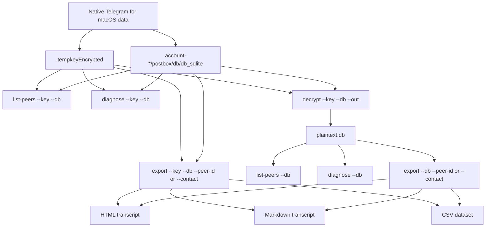
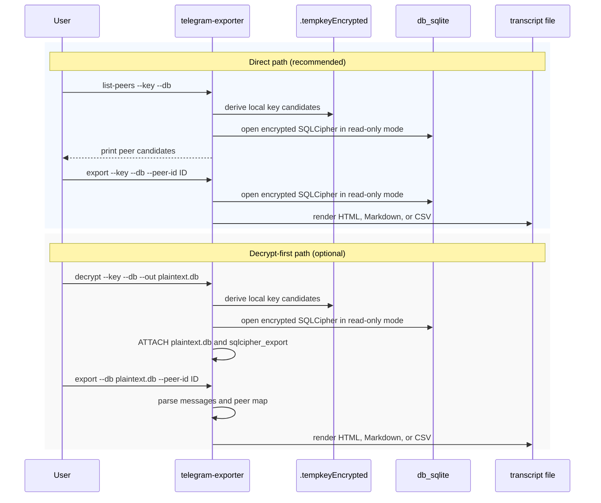

# 💬 Telegram for macOS Message Exporter

> Offline recovery and transcript export for the native Telegram for macOS app.

[](https://github.com/stek29/telegram-message-exporter/actions/workflows/ci.yml)
[](https://www.python.org/downloads/)
[](#requirements)
[](https://macos.telegram.org/)
[](LICENSE)
[](https://black.readthedocs.io/)
[](https://docs.astral.sh/ruff/)
[](https://pylint.readthedocs.io/)

Built for recovery situations where the only remaining copy of a Telegram
conversation is the encrypted local cache on a Mac. The tool decrypts the local
`db_sqlite`, understands Telegram's Postbox storage well enough to find peers
and messages, then writes a readable transcript in HTML, Markdown, or CSV.

This targets the **native Telegram for macOS app** from
[macos.telegram.org](https://macos.telegram.org/) or the Homebrew `telegram`
cask. It does **not** target the cross-platform Telegram Desktop/Qt app, iOS
backups, Android backups, the Mac App Store version, or Telegram's cloud export
format.

**Quick links:** [🚀 Quick Start](#quick-start) · [🔄 How It Works](#how-it-works) · [🧪 Usage](#usage) · [🧰 CLI Reference](#cli-reference) · [🩺 Troubleshooting](#troubleshooting) · [🙏 Credits](#credits)

## 🧭 Table of Contents

- [📖 Overview](#overview)
- [✨ Capabilities](#capabilities)
- [🔄 How It Works](#how-it-works)
- [✅ Requirements](#requirements)
- [🚀 Quick Start](#quick-start)
- [🧪 Usage](#usage)
- [🧰 CLI Reference](#cli-reference)
- [📄 Output Formats](#output-formats)
- [🗺️ Key Paths](#key-paths)
- [🔐 Safety and Privacy](#safety-and-privacy)
- [🩺 Troubleshooting](#troubleshooting)
- [⚠️ Limitations](#limitations)
- [❓ FAQ](#faq)
- [🔖 Versioning](#versioning)
- [🧹 Quality Checks](#quality-checks)
- [🗂️ Project Structure](#project-structure)
- [🙏 Credits](#credits)
- [🤝 Contributing](#contributing)
- [📄 License](#license)

---

<a id="overview"></a>

## 📖 Overview

Telegram for macOS stores local message data in an encrypted SQLite database.
When a chat has been deleted from Telegram's cloud state, the local cache can be
the last useful source of evidence, provided it still exists on disk and has
not been overwritten or synced away.

`telegram-message-exporter` provides a focused recovery path:

- copy `.tempkeyEncrypted` and the encrypted `db_sqlite` to a working
  directory and point the read subcommands at the copies via `--key`/`--db`
  (the recommended path; the originals are also accepted and opened
  read-only)
- optionally run `decrypt` to produce a standalone `plaintext.db` for
  other SQLite tools
- show the current account and list likely peers and contacts
- export one chat or all decoded messages to a clean transcript

The tool is intentionally offline. It does not call Telegram APIs, restore
messages back into Telegram, or upload recovered data anywhere.

### First Recovery Checklist

1. Stop using Telegram on the Mac as soon as possible.
2. Keep the Mac offline if you are trying to preserve a recently deleted chat.
3. Copy `.tempkeyEncrypted` and the encrypted `db_sqlite` into a separate
   working directory. The exporter opens them in read-only mode, but
   working from copies is the safest default.
4. Install the tool in a virtual environment.
5. Run `list-peers --key --db` against the copies from step 3 to find the
   chat you care about.
6. Export HTML first for reading, then CSV if you need analysis in a
   spreadsheet.
7. If you produced a `plaintext.db` with `decrypt`, store it securely
   alongside the transcripts; both contain private message content.

---

<a id="capabilities"></a>

## ✨ Capabilities

- **Offline decryption**: derives SQLCipher keys from Telegram's local
  `.tempkeyEncrypted` file
- **Passcode support**: accepts `--passcode` or `TG_LOCAL_PASSCODE` when
  Telegram Passcode Lock is enabled
- **Postbox parsing**: handles the native macOS app's key/value Postbox tables
- **Peer discovery**: searches local peer records so exports can use names
  instead of raw IDs where possible
- **Account discovery**: reads the current account peer ID and basic profile
  fields from the local Postbox database
- **Targeted exports**: filters by peer ID, contact name, message limit, start
  date, and end date
- **Readable output**: writes styled HTML, Markdown, or CSV with timestamps,
  speakers, directions, and link handling
- **Diagnostics**: samples tables and rows when Telegram storage changes or a
  cache does not match the expected shape

---

<a id="how-it-works"></a>

## 🔄 How It Works

The recommended flow is to copy `.tempkeyEncrypted` and the encrypted
`db_sqlite` into a working directory, then point `info` / `list-peers` /
`diagnose` / `export` at the copies via `--key` / `--db`. Both the encrypted and the
plaintext database are opened in read-only mode, so the originals (or
the copies) cannot be modified by these commands. The `decrypt` subcommand
is a thin wrapper for users who also want a standalone plaintext file
(for example, to inspect with other SQLite tools).



The CLI never needs Telegram network access. Everything comes from local files
that already exist on the Mac.



---

<a id="requirements"></a>

## ✅ Requirements

- macOS with native Telegram for macOS data present
- Python 3.10 or newer
- SQLCipher support for the `sqlcipher3` Python package
- Telegram local passcode, if Passcode Lock was enabled
- A virtual environment for local installs

On macOS, install SQLCipher first if `sqlcipher3` fails to build:

```bash
brew install sqlcipher
```

---

<a id="quick-start"></a>

## 🚀 Quick Start

### 1. Install

From a clone:

```bash
git clone https://github.com/stek29/telegram-message-exporter.git
cd telegram-message-exporter
python3 -m venv .venv
source .venv/bin/activate
pip install -e .
```

Or install the latest revision directly from GitHub:

```bash
pip install -U "git+https://github.com/stek29/telegram-message-exporter.git"
```

### 2. Locate Telegram's database

The native macOS app normally stores its data below:

```bash
TELEGRAM_STABLE="$HOME/Library/Group Containers/6N38VWS5BX.ru.keepcoder.Telegram/stable"
ls -la "$TELEGRAM_STABLE"
ls "$TELEGRAM_STABLE"/account-*/postbox/db/db_sqlite
```

You need:

- `.tempkeyEncrypted`, which is hidden from plain `ls` because it starts with `.`
- the matching `account-*/postbox/db/db_sqlite`

### 3. Copy the key and database to a working directory (recommended)

`info`, `list-peers`, `diagnose`, and `export` open both encrypted and plaintext
databases in read-only mode, so they cannot mutate the originals. Even so,
the recommended workflow is to copy `.tempkeyEncrypted` and the encrypted
`db_sqlite` into a separate working directory, then point the CLI at the
copies via `--key` / `--db`. That way the live Telegram data is never
touched, and no `plaintext.db` is left behind unless you actually need one.

```bash
mkdir -p ~/recovery
cp "$HOME/Library/Group Containers/6N38VWS5BX.ru.keepcoder.Telegram/stable/.tempkeyEncrypted" ~/recovery/
cp "$HOME/Library/Group Containers/6N38VWS5BX.ru.keepcoder.Telegram/stable/account-123456/postbox/db/db_sqlite" ~/recovery/db_sqlite
```

If Telegram Passcode Lock is enabled, you'll also need to pass `--passcode`
(or set `TG_LOCAL_PASSCODE`) in the commands that follow.

### 4. Find a peer

```bash
telegram-exporter list-peers \
  --key ~/recovery/.tempkeyEncrypted \
  --db ~/recovery/db_sqlite \
  --search "Alex"
```

### 5. Export a transcript

```bash
telegram-exporter export \
  --key ~/recovery/.tempkeyEncrypted \
  --db ~/recovery/db_sqlite \
  --peer-id 123456789 \
  --format html \
  --out ~/recovery/alex.html
```

### 6. (Optional) Decrypt to a standalone plaintext SQLite file

If you want a `plaintext.db` you can open with other SQLite tools (or
re-export from without re-deriving the key each time), run `decrypt`
against the working copy from step 3:

```bash
telegram-exporter decrypt \
  --key ~/recovery/.tempkeyEncrypted \
  --db ~/recovery/db_sqlite \
  --out ~/recovery/plaintext.db
```

If Telegram Passcode Lock is enabled:

```bash
TG_LOCAL_PASSCODE="your-passcode" \
telegram-exporter decrypt \
  --key ~/recovery/.tempkeyEncrypted \
  --db ~/recovery/db_sqlite \
  --out ~/recovery/plaintext.db
```

After this you can use the same read subcommands against
`~/recovery/plaintext.db` instead of passing `--key` (see the
[Usage](#usage) section for the two interchangeable forms).

---

<a id="usage"></a>

## 🧪 Usage

### Skip the `decrypt` step and read the encrypted `db_sqlite` directly

Every read subcommand (`diagnose`, `info`, `list-peers`, `export`) accepts the same
`--key` and `--passcode` flags as `decrypt`. When `--key` is present the
database is opened as SQLCipher in read-only mode; when it's absent the file
is opened as a plaintext SQLite database (also in read-only mode). The two
forms are interchangeable beyond that:

```bash
# Plaintext (from a prior `decrypt`):
telegram-exporter list-peers --db recovery/plaintext.db --search "Alex"
telegram-exporter export --db recovery/plaintext.db --peer-id 123456789

# Encrypted (no plaintext copy on disk):
telegram-exporter list-peers \
  --key "$HOME/Library/Group Containers/6N38VWS5BX.ru.keepcoder.Telegram/stable/.tempkeyEncrypted" \
  --db "$HOME/Library/Group Containers/6N38VWS5BX.ru.keepcoder.Telegram/stable/account-123456/postbox/db/db_sqlite" \
  --search "Alex"

telegram-exporter export \
  --key "$HOME/Library/Group Containers/6N38VWS5BX.ru.keepcoder.Telegram/stable/.tempkeyEncrypted" \
  --db "$HOME/Library/Group Containers/6N38VWS5BX.ru.keepcoder.Telegram/stable/account-123456/postbox/db/db_sqlite" \
  --peer-id 123456789
```

If Telegram Passcode Lock is enabled, add `--passcode` (or set
`TG_LOCAL_PASSCODE`):

```bash
TG_LOCAL_PASSCODE="your-passcode" telegram-exporter export \
  --key /path/to/.tempkeyEncrypted \
  --db /path/to/db_sqlite \
  --peer-id 123456789
```

`--db` is always opened in read-only mode — the encrypted SQLCipher file
and the plaintext SQLite file alike — so you cannot accidentally mutate
the original `db_sqlite` from these commands.

### Show the current account and export Saved Messages

```bash
telegram-exporter info --db recovery/plaintext.db
```

Example output:

```text
Current account:
  Peer ID: 123456789
  Name: Alice Example
  Username: @alice
  Phone: +1234567890
```

Saved Messages uses the current account's peer ID. Pass the reported ID to the
existing `export` command:

```bash
telegram-exporter export \
  --db recovery/plaintext.db \
  --peer-id 123456789 \
  --format html \
  --out recovery/saved-messages.html
```

For an encrypted database, add `--key /path/to/.tempkeyEncrypted` to both
commands. Username and phone are omitted from `info` when they are not present
in the local peer record.

### Export HTML for one chat

```bash
telegram-exporter export \
  --db recovery/plaintext.db \
  --peer-id 123456789 \
  --media-dir "$HOME/Library/Group Containers/6N38VWS5BX.ru.keepcoder.Telegram/stable/account-123456/postbox/media" \
  --format html \
  --out recovery/chat.html
```

When `--media-dir` is supplied, cached attachments referenced by exported
messages are copied to `recovery/chat_media/` and linked from the transcript.
If the database is used directly from its original `postbox/db/` directory,
the sibling `postbox/media/` directory is detected automatically.

### Export by contact name

```bash
telegram-exporter export \
  --db recovery/plaintext.db \
  --contact "Alex" \
  --format md \
  --out recovery/alex.md
```

If more than one peer matches, the command prints the candidates and asks you to
rerun with `--peer-id`.

### Export a date range

```bash
telegram-exporter export \
  --db recovery/plaintext.db \
  --peer-id 123456789 \
  --start-date 2024-01-01 \
  --end-date 2024-12-31 \
  --format html \
  --out recovery/chat-2024.html
```

### Export all decoded messages

```bash
telegram-exporter export \
  --db recovery/plaintext.db \
  --format csv \
  --out recovery/all-chats.csv
```

### Debug export queries

```bash
telegram-exporter export \
  --db recovery/plaintext.db \
  --peer-id 123456789 \
  --start-date 2024-01-01 \
  --end-date 2024-12-31 \
  --debug
```

Debug output is written to stderr and includes each SQL statement, its
hex-encoded Postbox key bounds, `EXPLAIN QUERY PLAN` output, elapsed time, and
the number of rows consumed. An optimized peer export should show indexed
lookups for both messages and the small set of referenced peer records:

```text
[query] plan: SEARCH t7 USING INDEX sqlite_autoindex_t7_1 (key>? AND key<?)
[query] consumed 10 rows in 0.012s: peer 123456789 (single key range)
[query] plan: SEARCH t2 USING INTEGER PRIMARY KEY (rowid=?)
```

### Inspect an unfamiliar database

```bash
telegram-exporter diagnose --db recovery/plaintext.db
```

Sample a specific table:

```bash
telegram-exporter diagnose --db recovery/plaintext.db --table t7
```

### Debug decryption

```bash
telegram-exporter decrypt \
  --key /path/to/.tempkeyEncrypted \
  --db /path/to/db_sqlite \
  --out recovery/plaintext.db \
  --debug
```

---

<a id="cli-reference"></a>

## 🧰 CLI Reference

| Command | Purpose |
| --- | --- |
| `decrypt` | Decrypt Telegram's encrypted `db_sqlite` to a plaintext SQLite file (optional; read commands can use `--key` directly) |
| `diagnose` | List tables, columns, and sample rows from a Telegram database |
| `info` | Show the current account peer ID and basic profile fields |
| `list-peers` | Find likely peer IDs by name fragment |
| `export` | Render messages to HTML, Markdown, or CSV |

### `decrypt`

| Flag | Required | Description |
| --- | --- | --- |
| `--key` | yes | Path to `.tempkeyEncrypted` |
| `--db` | yes | Path to encrypted `db_sqlite` |
| `--out` | no | Output plaintext DB path, default `plaintext.db` |
| `--passcode` | no | Telegram local passcode; can also use `TG_LOCAL_PASSCODE` |
| `--debug` | no | Print key/profile diagnostics |

### `diagnose`

| Flag | Required | Description |
| --- | --- | --- |
| `--db` | yes | Path to a Telegram DB (plaintext or encrypted `db_sqlite`); always opened in read-only mode |
| `--key` | no | Path to `.tempkeyEncrypted`; when given, `--db` is opened as SQLCipher instead of as plaintext SQLite |
| `--passcode` | no | Telegram local passcode; can also use `TG_LOCAL_PASSCODE`. Ignored for plaintext DBs. |
| `--table` | no | Table to sample; defaults to `t7` when present |

### `list-peers`

| Flag | Required | Description |
| --- | --- | --- |
| `--db` | yes | Path to a Telegram DB (plaintext or encrypted `db_sqlite`); always opened in read-only mode |
| `--key` | no | Path to `.tempkeyEncrypted`; when given, `--db` is opened as SQLCipher instead of as plaintext SQLite |
| `--passcode` | no | Telegram local passcode; can also use `TG_LOCAL_PASSCODE`. Ignored for plaintext DBs. |
| `--search` | no | Name fragment to filter peers |

### `info`

| Flag | Required | Description |
| --- | --- | --- |
| `--db` | yes | Path to a Telegram DB (plaintext or encrypted `db_sqlite`); always opened in read-only mode |
| `--key` | no | Path to `.tempkeyEncrypted`; when given, `--db` is opened as SQLCipher instead of as plaintext SQLite |
| `--passcode` | no | Telegram local passcode; can also use `TG_LOCAL_PASSCODE`. Ignored for plaintext DBs. |
| `--format` | no | Output format; currently `text` only |

### `export`

| Flag | Required | Description |
| --- | --- | --- |
| `--db` | yes | Path to a Telegram DB (plaintext or encrypted `db_sqlite`); always opened in read-only mode |
| `--key` | no | Path to `.tempkeyEncrypted`; when given, `--db` is opened as SQLCipher instead of as plaintext SQLite |
| `--passcode` | no | Telegram local passcode; can also use `TG_LOCAL_PASSCODE`. Ignored for plaintext DBs. |
| `--contact` | no | Contact name to resolve to a peer |
| `--peer-id` | no | Numeric peer ID to export |
| `--table` | no | Override detected message table |
| `--limit` | no | Maximum number of messages |
| `--start-date` | no | Start date, `YYYY-MM-DD` or ISO datetime |
| `--end-date` | no | End date, `YYYY-MM-DD` or ISO datetime |
| `--format` | no | `html`, `md`, or `csv`; default `md` |
| `--out` | no | Output path; defaults to `chat_export.<format>` |
| `--media-dir` | no | Telegram `postbox/media` cache; copies referenced files beside the export |
| `--show-direction` | no | Append `(in)` or `(out)` labels in Markdown |
| `--debug` | no | Print SQL key ranges and `EXPLAIN QUERY PLAN` output |

---

<a id="output-formats"></a>

## 📄 Output Formats

| Format | Best for | Notes |
| --- | --- | --- |
| `html` | Reading and sharing a polished transcript | Includes summary cards, date jump, back-to-top, and link handling |
| `md` | Archival text, notes, version control | Compact, portable, and easy to diff |
| `csv` | Analysis in spreadsheets or scripts | Includes message metadata and a JSON attachments column |

### Markdown snippet

```markdown
# Telegram Chat History: Alex Example

**Exported:** 2026-02-04 16:05:12

**Total Messages:** 418

---

## Wednesday, February 04, 2026

**14:13:09 — Me**

3h48 is good also
```

### CSV snippet

```csv
date,time,timestamp,direction,speaker,text,peer_id,author_id
2026-02-04,14:13:09,1770214389,out,Me,"3h48 is good also",123456789,123456789
```

---

<a id="key-paths"></a>

## 🗺️ Key Paths

Native Telegram for macOS typically stores recovery-relevant files here:

```text
~/Library/Group Containers/6N38VWS5BX.ru.keepcoder.Telegram/stable/
├── .tempkeyEncrypted
└── account-*/
    └── postbox/
        └── db/
            └── db_sqlite
```

The `account-*` directory must match the database you are decrypting. If there
are multiple accounts, try `list-peers` (with `--key` for each `account-*`) and
keep notes about which `account-*` directory produced which peer results.

---

<a id="safety-and-privacy"></a>

## 🔐 Safety and Privacy

- Copy `.tempkeyEncrypted` and the encrypted `db_sqlite` into a working
  directory and run the exporter against the copies. The read subcommands
  also accept the original paths (they open in read-only mode), but working
  from copies is the safest default.
- Keep the Mac offline during time-sensitive recovery to avoid sync changes.
- Treat `plaintext.db` (if you produced one with `decrypt`), HTML, Markdown,
  and CSV outputs as sensitive private data.
- Delete or encrypt intermediate files when recovery work is complete.
- The tool reads local files and writes local outputs only; it does not contact
  Telegram or any third-party recovery service.

---

<a id="troubleshooting"></a>

## 🩺 Troubleshooting

| Symptom | What to check |
| --- | --- |
| `Key file not found` | Confirm the `.tempkeyEncrypted` path and quote paths containing spaces |
| `Database file not found` | Confirm the selected `account-*` directory has `postbox/db/db_sqlite` |
| `Failed to decrypt database` | Verify the key and DB belong to the same Telegram account; pass `--passcode` if Passcode Lock was enabled |
| `file is not a database` on a read command without `--key` | The file looks like an encrypted `db_sqlite`; rerun with `--key PATH` (and `--passcode` if needed) |
| `Unable to derive any key material` | The `.tempkeyEncrypted` could not be parsed; double-check `--passcode` and that the file belongs to the selected `account-*` |
| `No peer records found` | Run `diagnose` and confirm this is the native macOS Telegram database |
| `No messages found with the current filters` | Remove date filters, confirm `--peer-id`, or try exporting all decoded messages |
| `sqlcipher3` install fails | Install SQLCipher with Homebrew, then reinstall the package in a clean virtual environment |

For decryption problems, rerun with `--debug`:

```bash
telegram-exporter decrypt \
  --key /path/to/.tempkeyEncrypted \
  --db /path/to/db_sqlite \
  --out recovery/plaintext.db \
  --debug
```

---

<a id="limitations"></a>

## ⚠️ Limitations

- Does not restore messages into Telegram.
- Does not bypass a Telegram local passcode; you need the passcode.
- Does not recover messages that no longer exist in the local cache.
- Does not download content from Telegram servers.
- Only locally cached media can be copied; unavailable files are represented by
  attachment metadata and are not downloaded.
- Some newer or uncommon Telegram message payloads may only partially decode.
- Does not support Telegram Desktop/Qt, the Mac App Store version, mobile
  backups, or Telegram cloud export archives.

---

<a id="faq"></a>

## ❓ FAQ

### Can this restore a deleted chat inside Telegram?

No. It exports a transcript from local data; it does not write messages back to
Telegram.

### Should I use the original Telegram database directly?

The `info`, `list-peers`, `diagnose`, and `export` commands can read the encrypted
`db_sqlite` in place when you pass `--key`. Both the encrypted and the
plaintext database are opened in read-only mode, so the original is never
modified by these commands. Even so, for recovery work it is still
recommended to copy `.tempkeyEncrypted` and the encrypted `db_sqlite` into
a separate working directory and run from those copies — that way a stray
`decrypt` (or any future write-capable tool) cannot touch the live data,
and no plaintext copy is left behind unless you explicitly need one.

### Why does this only support Telegram for macOS?

The native macOS app uses a different storage layout from Telegram Desktop/Qt
and mobile clients. This project is built around the native app's local
Postbox/SQLCipher data.

### Does it work with the Mac App Store version?

No. This currently targets the direct download/Homebrew build from
macos.telegram.org. The Mac App Store version uses a different app packaging and
storage setup, so it is outside the supported recovery path.

### Can it recover photos, videos, or documents?

Yes, when the corresponding files still exist in Telegram's local
`postbox/media` cache. Pass `--media-dir`; the exporter copies referenced files
beside the transcript. Missing cache files are listed as attachment metadata but
cannot be downloaded.

---

<a id="versioning"></a>

## 🔖 Versioning

The canonical version is stored in [`VERSION`](VERSION) and exposed by the CLI:

```bash
telegram-exporter --version
```

Use the helper script when preparing a version bump:

```bash
.github/scripts/bump_version.py patch
.github/scripts/bump_version.py minor
.github/scripts/bump_version.py major
.github/scripts/bump_version.py --set 1.2.3
```

---

<a id="quality-checks"></a>

## 🧹 Quality Checks

The CI workflow runs Black, Ruff, and Pylint across Python 3.10 through 3.13.

```bash
pip install black ruff pylint
black --check src/telegram_message_exporter telegram_exporter.py .github/scripts/bump_version.py
ruff check src/telegram_message_exporter telegram_exporter.py .github/scripts/bump_version.py
pylint src/telegram_message_exporter telegram_exporter.py
```

---

<a id="project-structure"></a>

## 🗂️ Project Structure

```text
telegram-message-exporter/
├── .github/
│   ├── dependabot.yml                 # Dependency update schedule
│   ├── scripts/
│   │   └── bump_version.py            # Version helper
│   └── workflows/
│       └── ci.yml                     # Python lint matrix
├── pyproject.toml                     # Packaging metadata and CLI entrypoint
├── telegram_exporter.py               # Convenience wrapper for source checkouts
├── src/
│   └── telegram_message_exporter/
│       ├── __init__.py                # Version metadata
│       ├── __main__.py                # python -m entrypoint
│       ├── cli.py                     # Argument parsing and commands
│       ├── crypto.py                  # SQLCipher and tempkey handling
│       ├── db.py                      # DB heuristics and message extraction
│       ├── exporters.py               # HTML, Markdown, and CSV renderers
│       ├── hashing.py                 # MurmurHash helper
│       ├── models.py                  # Message data model
│       ├── postbox.py                 # Postbox parsing utilities
│       └── utils.py                   # Date parsing and link helpers
├── requirements.txt                   # Runtime dependencies
├── VERSION                            # Canonical package version
├── LICENSE
└── README.md
```

---

<a id="credits"></a>

## 🙏 Credits

This project builds on community reverse-engineering work. Special thanks to
**[@stek29](https://github.com/stek29)** for the original research and
[reference implementation](https://gist.github.com/stek29/8a7ac0e673818917525ec4031d77a713)
of Telegram for macOS local key format and Postbox structure.

---

<a id="contributing"></a>

## 🤝 Contributing

Issues and pull requests are welcome, especially for:

- additional Telegram for macOS storage variants
- safer recovery workflows
- better Postbox decoding
- export formatting improvements
- tests around real-world cache shapes

Please keep recovery and privacy in mind when sharing examples. Do not attach
private Telegram databases or transcripts to public issues.

---

<a id="license"></a>

## 📄 License

This project is licensed under the MIT License. See [`LICENSE`](LICENSE) for
details.
